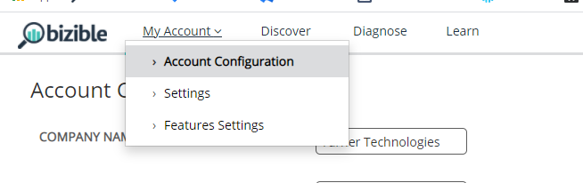
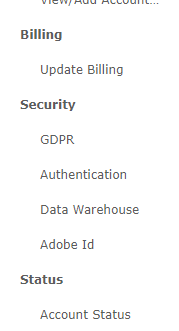
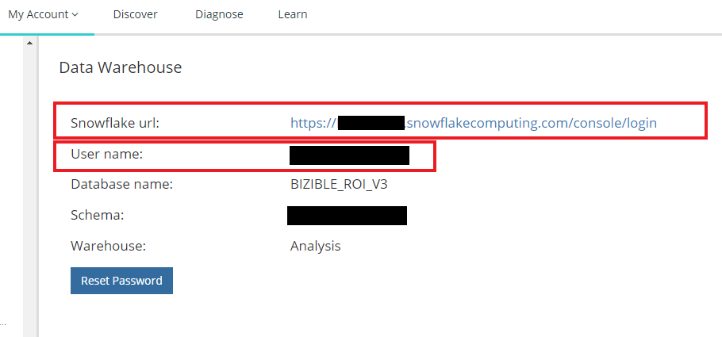
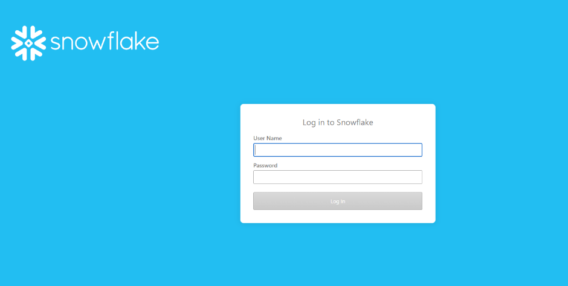
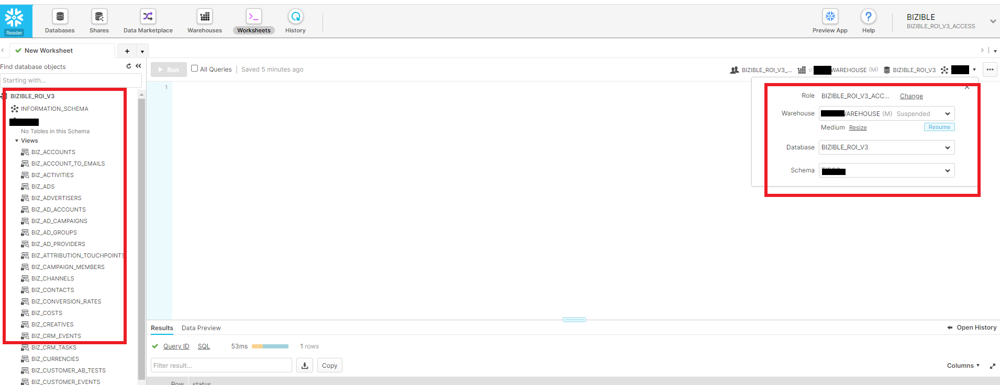
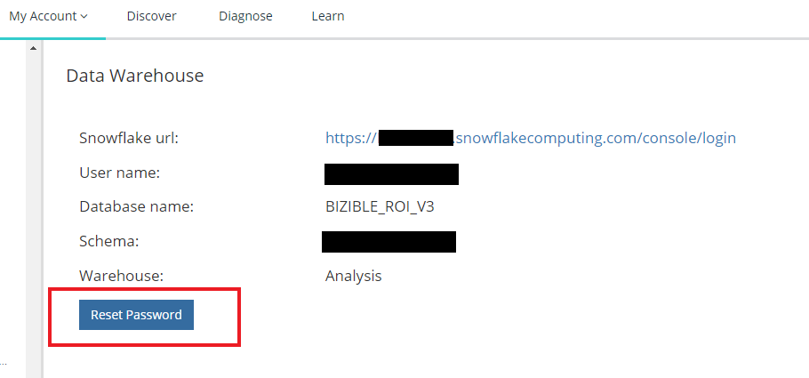
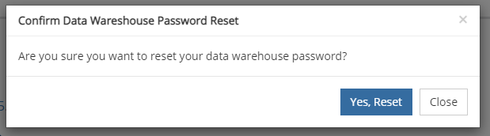
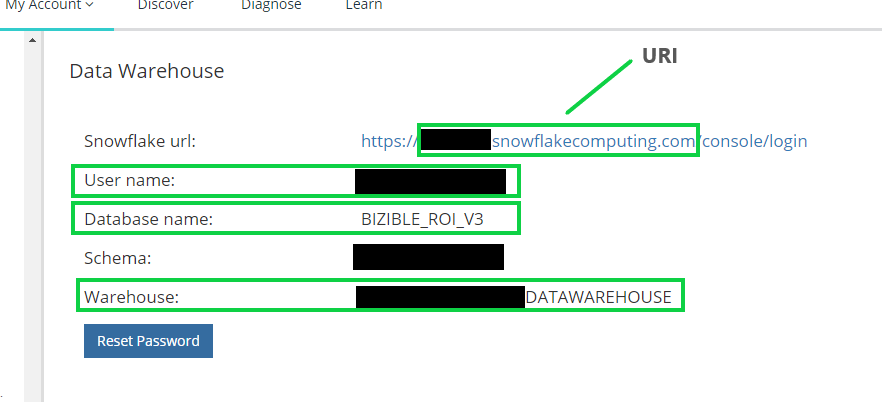

# Connecting to the Snowflake Data Warehouse {#connecting-to-the-snowflake-data-warehouse}

## Snowflake Access Link {#snowflake-access-link}

To access your Snowflake data warehouse, you'll need to navigate to the specific URL for your Snowflake account.  You can find this access link by logging into Bizible and following the steps below to navigate to the Data Warehouse information page.

1. In Bizible, at the top of the page, Click **My Account** > **Settings**.

   

1. On the left side menu, under Security, Click **Data Warehouse**.

   

1. On this page, you'll find the link to your Snowflake data warehouse and your username.

   

1. Click the link provided in the Snowflake URL, this will take you to the Snowflake login page where you'll enter your username and password. _If you don't have your password, see the steps below to reset it_.

   

1. Once logged in, Click **Worksheets** at the top of the page.

   

1. The BIZIBLE_ROI_V3 database objects are on the left side of the screen.  Enter the Warehouse, Database, and Schema from the dropdown options at the top of the query window.  There should only be one option for each.  Now you are ready to execute queries inside the Snowflake query editor.

   

## Reset Your Password {#reset-your-password}

Bizible does not have access to your Snowflake login password.  If you need to reset your password, Click the Reset Password button on the Data Warehouse information page, and follow the instructions.  A temporary password will be provided; you will be prompted to create a new password when you login to the data warehouse.

   

   

## Connecting to Snowflake via Third-Party Tools {#connecting-to-snowflake-via-third-party-tools}

You'll need to enter a few pieces of information to connect your Snowflake data warehouse to a third-party tool.  

>[!NOTE]
>
>Each tool has different connection requirements; it's recommended you consult the documentation for the specific tool you're trying to connect.

* **URI** (always required)
  * This is the domain name of the Snowflake account.  It is contained within a portion of the Snowflake login link.  
* **Username** (always required)
  * The username is listed on the Data Warehouse information page in Bizible.
* **Password** (always required)
  * This is the password you set the first time you logged into your Snowflake account.  To reset your password, please see the steps outlined above.
* **Database Name** (not always required)
  * The database is what stores the data in Snowflake. It is the storage resource. The database name is listed on the Data Warehouse information page in Bizible.
* **Warehouse Name** (not always required)
  * The warehouse is what executes queries in Snowflake. It is the compute resource.  The warehouse name is listed on the Data Warehouse information page in Bizible.

   
