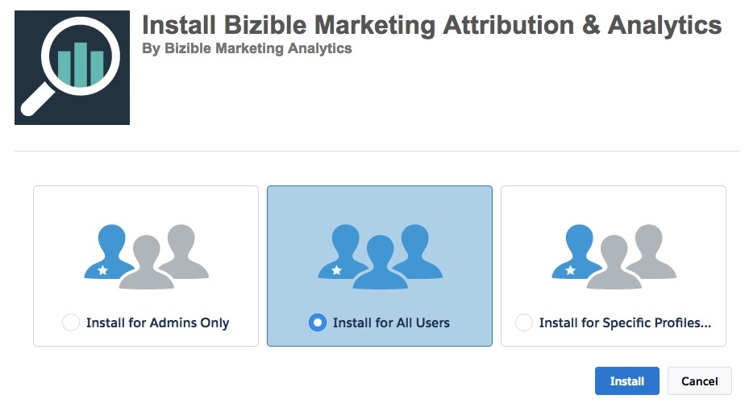
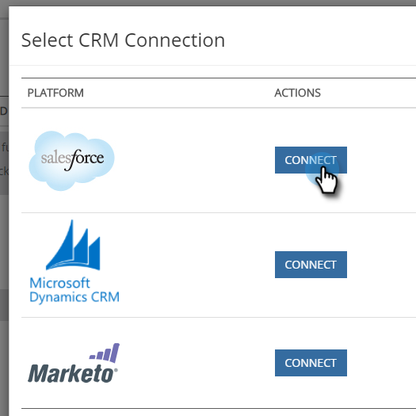
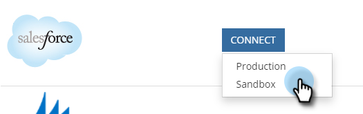
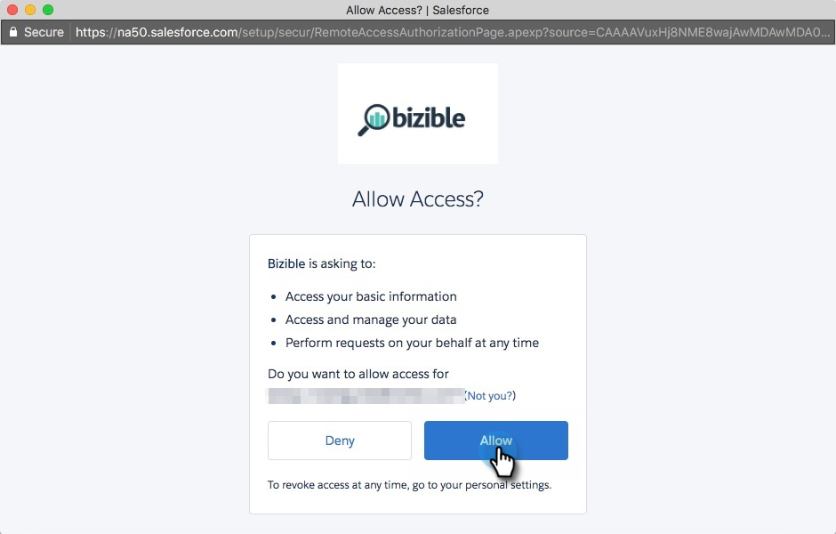

# Bizible Installation Guide {#bizible-installation-guide}

In this guide we will be walking you through how to install and set up Bizible. For implementation we will need admin level access to the following:

* Salesforce
* Integrated Ad Platforms - AdWords, Bing Ads, and Facebook
* Website

## Salesforce Packages to Install {#salesforce-packages-to-install}

We will be installing two packages within your Salesforce environment and then completing additional configuration for full visibility into Bizible.  
  
[Bizible.com/sf](https://bizible.com/sf): This is our base package which includes our custom objects and fields. We recommend installing within Production for all users.  
  
[Bizible.com/dashboard-mt](https://bizible.com/dashboard-mt): This is our Dashboard Extension Package, which contains 3 pre-built dashboards. We recommend installing within Production for all users.

## Salesforce Configuration {#salesforce-configuration}

[Page Layouts](/help/configuration-and-setup/bizible-and-salesforce/page-layout-instructions.md): This is not necessary, but making these page layout updates allows Bizible Touchpoints to be visible on an individual record.

[Bizible Permission Sets](/help/configuration-and-setup/bizible-and-salesforce/bizible-permission-sets.md): These are assigned to the users of the Bizible product based on the level of accessibility you’d like the users to have.

[Sharing Reports and Dashboard Folders](https://help.salesforce.com/articleView?id=analytics_share_folder.htm&type=0): Out of the box, the reports and dashboard folders we create are only visible to the install user. These will need to be shared with additional Bizible users.

[Hide Report Types](/help/configuration-and-setup/bizible-and-salesforce/hiding-unnecessary-report-types.md): Many of the Report Types we create within our product are not needed. To avoid confusion when learning to report on the product, we recommend hiding those that you don't need.

[Custom Amount Field Workflow](/help/advanced-bizible-features/custom-revenue-amount/using-a-custom-revenue-amount-field.md) (if necessary): If you are using a custom amount field to record revenue in Salesforce, we will need a workflow created to map this field value to our Bizible Opportunity Amount field for revenue attribution reporting. Please be sure to let your Success Manager know if you're using a custom amount.
 &nbsp;

## Set up Your Adobe Admin Console and Identity Provider {#set-up-your-adobe-admin-console-and-identity-provider}

The first step to using Bizible is to create and sign-in to your provisioned Adobe Admin Console. If you haven't already received the email with log in instructions, please contact your Bizible Account Representative.

As a product within the Adobe Suite, Bizible leverages the full functionality of Adobe Admin Console for Identity Management. More resources can be found here: [https://helpx.adobe.com/enterprise/using/admin-console.html](https://helpx.adobe.com/enterprise/using/admin-console.html).

We recommend reviewing all of the resources, best practices, and options available to you for Identity Management: [https://helpx.adobe.com/enterprise/using/set-up-identity.html](https://helpx.adobe.com/enterprise/using/admin-console.html).

For guidance and review of setting up your Identity Management within the Adobe Admin Console, please reach out to your Bizible Account Representative.

In order to facilitate user authentication and authorization with your Bizible instance(s), the following steps are required within the Adobe Admin Console:

**Setting Up the Bizible Product Card**

>[!NOTE]
>
>This section applies to those provisioned _after_ 12/7/2020. For those provisioned prior to this date, please make sure you follow the steps to setup Global User Groups in the 'Setting up User Groups in the Adobe Admin Console' section below.

Upon accessing the Adobe Admin Console, you will see your Bizible Product instance(s) present in the Overview section.

   

Clicking the Bizible Product Card will show you all of your Bizible instance(s). By default, each Bizible Instance has its own profile, called 'Bizible'. Any Admins or Users added to this or any other profile within this instance will be able to log in to Bizible.

   

No action is required to create a new profile or setup anything specific within the Bizible Product instance(s).

To begin adding users who can access Bizible, please refer to the [Adding Bizible Admins and Bizible Users](#adding-bizible-admins-and-bizible-users) section below.

**Setting up User Groups in the Adobe Admin Console**

>[!NOTE]
>
>This section only applies to those provisioned _before_ 12/7/2020. If you were provisioned prior to 12/7/2020, you will not see a Bizible Product Card, and the steps below are required in the Adobe Admin Console for User Management. For those provisioned after 12/7/2020, please instead refer to the 'Setting Up the Bizible Product Card' section above.

1. Navigate to https://adminconsole.adobe.com/overview.

1. In the Admin Console, click **Users**.

   

1. Click **User Groups**.

   

1. Click **New User Group**.

   

1. Under User Group Name, enter "BizibleAdmins" (without the quotes) and click **Save**.

   

>[!CAUTION]
>
>The text in the User Group Name field is character specific. User Group Names need to be _exactly_ BizibleAdmins and BizibleUsers (as shown in Step 7), or you will receive an error.

1. Click **New User Group** again.

   

1. Under User Group Name, enter "BizibleUsers" (without the quotes) and click **Save**.

   

## Adding Bizible Admins and Bizible Users {#adding-bizible-admins-and-bizible-users}

After you've created User Groups or have the Default Product Profile set up in your Bizible instance(s), the next step is to grant access to the Bizible application by adding users. This can be done in the admins and users directory of the Bizible product card.

>[!NOTE]
>
>If you were provisioned prior to 12/7/2020, users must be added to one of the two groups created here. This is where all Users who wish to access Bizible must be added, including Adobe Admin Console Administrators.

|User Group|Description|
|---|---|
|BizibleAdmins|these are administrators and power users of the Bizible Application with full ability to update and manage Bizible-specific configuration options|
|BizibleUsers|these are standard users of the Bizible Application with read only permissions within the Bizible application|

When adding a user to their respective group, you'll see their [Identity Type listed](https://helpx.adobe.com/enterprise/admin-guide.html/enterprise/using/set-up-identity.ug.html).

**Signing in to Bizible**

After a user has been added to a group or a Product Profile, they're able to access their Bizible instance(s) by choosing the **Sign in with Adobe ID** option at [https://apps.bizible.com](https://apps.bizible.com).

   

 &nbsp;

## Configuring your Connections and Data Providers {#configuring-your-connections-and-data-providers}

Once you've logged-in to the Bizible application as a user in the BizibleAdmins group within the Adobe Admin Console, it's time to set up your various data connections.

**CRM as a Data Provider**

1. In your Bizible account, click the **My Account** drop-down and select **Settings**.

   

1. Under Integrations in the left nav, click **Connections**.

   

1. Click the **Set Up New CRM Connection** button.

   

1. Next to Salesforce, click the **Connect** button.

   

1. Select Production or Sandbox.

   

   >[!NOTE]
   >
   >For more information, refer to this page: [Sandbox Testing](/help/configuration-and-setup/sandbox-testing/testing-a-staging-environment.md). If you have any questions about this process, please contact your Bizible Account representative.

1. Once you've selected your connection option, you'll be prompted to connect to your Salesforce instance and give access to the Bizible application. Click **Allow**.

   

After connecting, you'll see the details of your Salesforce connection in the CRM/MAP Connections list.

**Ad Account Connections**

To connect your Ad Accounts with Bizible, start by visiting the Connections tab within the Bizible application.

1. Follow Steps 1 & 2 from the **CRM as a Data Provider** section.

1. Click the **Set up New Ads Connection** button.

   

1. Select your desired platform.

   

**Bizible Javascript**

In order for Bizible to track your web activities, there are multiple steps for setup.

1. Click the **My Account** drop-down and select **Account Configuration**.

   

1. Enter your phone number. For Website, enter your primary root domain that will be used for Bizible tracking on your website. Click **Save** when done.

   

   >[!NOTE]
   >
   >To add multiple root domains, please contact your Bizible Account Representative.

1. The [Bizible JavaScript](/help/bizible-tracking/setting-up-tracking/adding-bizible-script.md) then needs to be placed across the entire site and landing pages. We recommend hardcoding the script within the head of your landing pages or adding through a Tag Management System such as [Google Tag Manager](/help/bizible-tracking/setting-up-tracking/adding-bizible-script-via-google-tag-manager.md).
